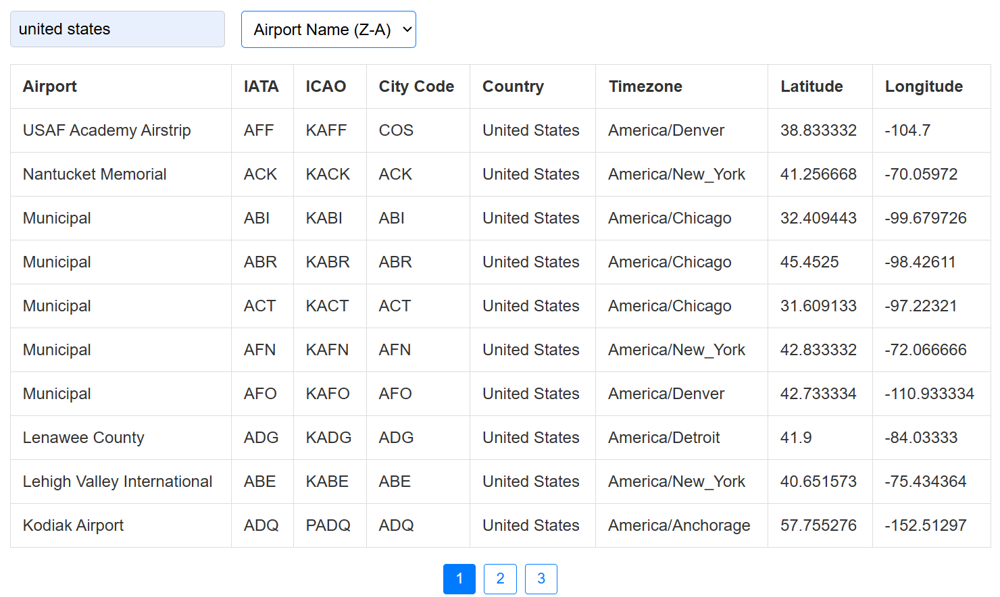
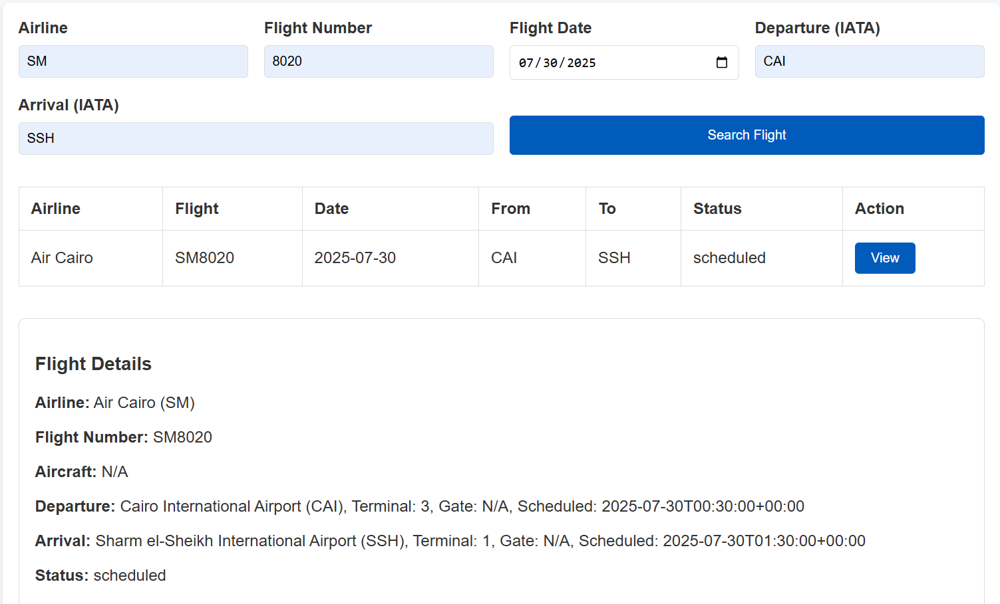
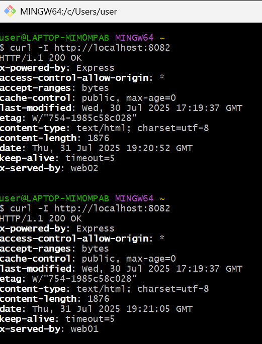

# Airport and Flight Search App

This application is a browser-based tool built with HTML, CSS, and JavaScript, and it uses Node.js on the backend to securely retrieve API data. The primary function of the app is to allow users to search for airport and flight data from the AviationStack API.

## Overview

Users can search through thousands of global airports and flights, view relevant details, and interact with the results using features like filtering, sorting, and pagination. The app is divided into two main search sections:
- **Search Airports**: Users can filter, sort, and paginate airport data.


- **Search Flights**: Users can submit flight details via a form to look up real-time or scheduled flight information.


## Docker Hub Image

- **Repository**: [https://hub.docker.com/repository/docker/flaviaa4/my-airport-app](https://hub.docker.com/repository/docker/flaviaa4/my-airport-app)
- **Image**: `flaviaa4/my-airport-app`
- **Tag**: `v1`

## Build Instructions (Local)

```bash
# Clone the repo and navigate into the docker folder
git clone <repo_url>
cd <repo_folder>

# Create a .env file
echo "AVIATIONSTACK_KEY=your_key_here" > .env
echo "PORT=8080" >> .env

# Build Docker image
docker build -t flaviaa4/my-airport-app:v1 .
```

## Run Instructions (Local)

```bash
docker run -p 8080:8080 --env-file .env flaviaa4/my-airport-app:v1
```

## Run Instructions on Web01 and Web02

```bash
sudo docker pull flaviaa4/my-airport-app:v1

sudo docker run -d \
  --name app \
  --restart unless-stopped \
  -p 8085:8085 \
  -e AVIATIONSTACK_KEY=your_key_here \
  -e PORT=8085 \
  flaviaa4/my-airport-app:v1
```

## Load Balancer Configuration (HAProxy on lb-01)

```haproxy
global
    daemon
    maxconn 256

defaults
    mode http
    timeout connect 5s
    timeout client  50s
    timeout server  50s

frontend http-in
    bind *:80
    default_backend webapps

backend webapps
    balance roundrobin
    server web01 172.20.0.11:8085 check
    server web02 172.20.0.12:8085 check
    http-response set-header X-Served-By %[srv_name]
```

### Reload HAProxy

```bash
sudo haproxy -f /etc/haproxy/haproxy.cfg
```

## Testing & Verification

Verify the load balancer with:

```bash
curl -I http://localhost:8082
```

Expected output alternates `X-Served-By` between `web01` and `web02`, confirming round-robin load balancing.


## Hardening (Secrets Handling)

Avoid hardcoding API keys:
- Use `--env-file` for local development.
- Pass environment variables using `-e` for deployments.
